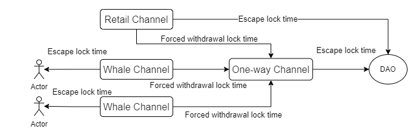
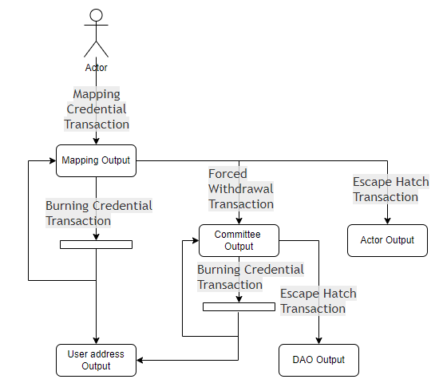

# Self Custody

By combining Taproot with [DHC](https://docs.bool.network/interoperability-protocol/dynamic-hidden-committee-dhc), Bool Network enables Bitcoin DeFi with self-custody, ensuring cryptographic trust for Restaking, Bitcoin-Collateralized Stablecoin, and Bridge applications on native Bitcoin.


## Channels

### Whale Two-way Channel

Any user is eligible to submit an application to the system to open an exclusive whale channel. After a strict review process, applicants who meet the requirements will be granted the identity of a valid channel. While ensuring the characteristics of decentralization and self-custody, this channel can successfully mint BTC into WBTC. When users use the whale channel to convert WBTC back to BTC, they need to obtain the explicit confirmation of the owner of the whale channel. If the whale owner does not confirm and exceeds the preset time-lock period of the channel, the system will intervene and safely transfer the BTC in the whale channel to the one-way channel, and this operation is called a forced withdrawal.Users can retrieve their BTC via a one-way Channel. 

Once the DHC fails, and the time lock expires, the project will have the right to withdraw BTC assets from the Whale Channel and ensure that these assets are distributed to each user in a fair and orderly manner.

Asset unlocking conditions: 1. The owner of the channel and the committee agree. 2. The time lock for forced withdrawal expires. 3. The escape time lock expires.

### Retail Two-way Channel

The retail channel, as a special case of the whale channel, has the privilege of being opened exclusively by the Bool Network team. It not only has all the functions of the whale channel but is also renowned for its automation, high-efficiency response, and convenience in handling small-amount operations, bringing users an unprecedented user experience. 

Asset unlocking conditions: 1.The Bool Network team and the committee agree. 2. The time lock for forced withdrawal expires. 3. The escape time lock expires.

### One-way Channel

The one-way channel focuses on the one-way conversion from WBTC to BTC and is used to store assets from forced withdrawals. It can smoothly convert WBTC back to BTC even in the face of failures in the whale or retail channels. Once the one-way channel fails, all assets will be quickly and safely transferred to the multi-signature address to ensure the safety of the assets.

Asset unlocking conditions: 1. The committee agrees. 2. The escape time lock expires.




Two time periods that need attention are the "escape lock time" and the "forced withdrawal lock time". Generally, the escape lock time is longer than the forced withdrawal lock time. The system sets the escape lock time equal to the forced withdrawal lock time plus six months, which means that the system has a six-month response time to transfer the assets of abnormal channels to the one-way channel. Meanwhile, the escape lock time of the one-way channel is longer than that of the non-one-way channels, so that users have sufficient response time to convert WBTC back to BTC.

> **Note: The escape lock time of the one-way channel > The escape lock time of the non-one-way channels > The forced withdrawal lock time.**


## Working Flow

The diagram illustrates the process of creating and spending various Bitcoin outputs through different transactions as described in the following paragraphs:



### Types of transactions

There are four types of transactions in the Bool Network system:

- Mapping Credential Transaction
- Burning Credential Transaction
- Forced Withdrawal Transaction
- Escape Hatch Transaction

### Mapping Credential Transaction

The mapper generates WBTC by creating a mapping transaction. This is a Bitcoin transaction where a certain amount of bitcoins to be minted is submitted to a mapping script approved by Bool Network. These scripts lock a selected number of BTC.
The requirements for a valid mapping transaction are:

- It can contain an arbitrary number of inputs.
- It can contain any number of outputs. One of these outputs must be the taproot output submitted to the BTC mapping script recognized by Bool Network. Hereafter called the mapping output. The output must also contain an OP_RETURN with the information that needs to be map.

OP_RETURN output description：

```text
TxOut {
     Value: 0,
     PkScript: MapOpReturnScript
}
```

MapOpReturnScript = 0x6a || 0x47 || SerializedMapOpReturnData

```text
type MapOpReturnData struct {
    dst_chain             []byte
    receiver_bytes_len      byte
    receiver_bytes        []byte
}
```

Fields description:

- dst_chain: 4 bytes, u32 format of the EVM chain ID of the target chain.
- receiver_bytes_len:  1 byte, Represents the length of the recipient's address.
- receiver_bytes：The address of the recipient on the destination chain, expressed in bytes.

### Burning Credential Transaction

When BTC mappers want to redeem their assets before the originally promised time lock expires, they use the burning credential transaction.
The requirements for a valid burning credential transaction are:

- It can contain any number of inputs that point to the mapping output of the mapping credential transaction。
- It can contain at least two outputs, the first is the address of the BTC mapper. the second must also contain an OP_RETURN with burn information. If the selected input amount has excess BTC assets after deducting the burn amount, a taproot output of the BTC mapping script identified by Bool Network is added.

OP_RETURN output description：

```text
TxOut {
     Value: 0,
     PkScript: BurnOpReturnScript
}
```

BurnOpReturnScript = 0x6a || 0x47 || SerializedBurnOpReturnData

```text
type BurnOpReturnData struct {
    uid                       []byte
}
```

Fields description：

- uid: Unique identifier for the burn operation。

### Forced Withdrawal Transaction

When the BTC mapper does not burn the assets before the time lock expires, due to disagreements over the content of the burning credential transaction, the committee will use a forced withdrawal transaction to transfer the assets out of the mapping script.
The requirements for a valid forced withdrawal transaction are:

- It can contain any number of inputs that point to the mapping output of the mapping transaction.
- It contains only one output, which must be the taproot output submitted to the mapping script recognized by Bool Network. Unlike mapping credential transaction, the output of a forced withdrawal transaction does not require an additional OP_RETURN.

### Escape Hatch Transaction

When the BTC mapper did not burn the assets before the time expired, because the private key of the committee was lost, the validator used the escape hatch transaction to transfer the assets from the mapping script.
The requirements for a valid escape hatch transaction are:

- It can contain any number of inputs that point to the mapping output of the mapping credential transaction.
- It can contain an arbitrary number of outputs.

### Mapping Output Script

Mapping output is a taproot output that can only be spent via script spend paths. For the key spend path, we consider it unavailable by default because the internal key is a combination of the committee private key and the user private key.
Minting output can be spent via three script spend paths.

#### 1. Escaping path

Escaping path transfers the minter's Bitcoin to DAO. Its script form:

```text
<TIME>  OP_CLTV OP_DROP <ValidatorPk> OP_CHECKSIG
```

- < `TIME` > : It’s unbinding time.
- < `ValidatorPk` >: The validator public key of the Bool Network system.

#### 2. Enforcing path

Enforcing path transfers assets locked by the mapper to the committee. Its script form:

```text
<TIME>  OP_CLTV OP_DROP <CommitteePk> OP_CHECKSIG
```

- < `TIME` > : It's unbinding time. The enforcing timelock is much smaller than the escaping timelock.
- < `CommitteePk` >: The public key of the committee of the Bool Network system.

#### 3. multi-sign path

The multi-sign path is used to burn the mapper's assets in case of double signatures. Its script form:

```text
<MapperPK> OP_CHECKSIGVERIFY <CommitteePK> OP_CHECKSIG
```

- < `MapperPK` >：BTC mapper public key.
- < `CommitteePK` >：Dynamic committee public key for Bool Network system.
  

## What is Taproot?

Taproot is a significant advancement in contract publication on the blockchain, addressing various concerns by enabling settlement through the publication of only relevant contract portions. This innovation not only enhances security but also introduces a new, expansive language for improved flexibility and scalability. 

1. Schnorr Signatures (BIP 340)
SigHash(Signature Hash) is applied to the transactions, meaning that once a SigHash is applied, the information becomes immutable(unchangeable). If the information is changed, the trasaction loses validity. Nothing can be changed without destorying the SigHash. Previously, a small amount of information could be changed through "malleability" that would not result in the transaction losing its validity.

2. Taproot (BIP 341) [MAST]
Bitcoin Script Update allows the scripting language to use Schnorr signatures and integrates the Merkelized Alternative Script Trees(MAST).

3. Tapscript
Tapscript is a collection of "opcodes", which are essentially just lines of codes that execute commands on the Bitcoin protocol that have been updated to make way for the new changes installed by Taproot. It can be referred to as a language, but it is more like an update to Bitcoin Script.

## What is TimeLock?

A Timelock is a smart contract primitive in Bitcoin that restricts the spending of bitcoins until a specified future time or block height. Simply put, Timelocks hinder miners from confirming a transaction until certain conditions are met. 

There are four major options for Bitcoin timelocks - nLocktime, nSequence, OP_CHECKLOCKTIMEVERIFY (OP_CLTV), and OP_CHECKSEQUENCEVERIFY (OP_CSV). Two of these options are script-level time locks, while the other two are transaction-level time locks.

## Multi-Sign Escape Hatch

Multi-Sign Escape Hatch uses the multi-sign tapscript and timelock tapscript to support joint asset maintenance by multiple parties. It has two payment methods, when all signers agree on a certain spending output, then execute a multi-sign trapscript script. If any of them do not agree and the time expires, the time lock trapscript is executed and the output is spent by the validator specified in the script.

### How to build the Multi-Sign Escape Hatch address

Standard Taproot address generation formula:

```text
Q= P+H(P|c)G
Q = the final Taproot public key
P = the internal public key
H(P|c) = A hash of the internal public key and the commitment
c = MAST
```

To sign a transaction with our private key, adjust the private key using the same hash value H (P|c) as the public key and commitment.

Taproot uses a simple trick involving something called a "merkle tree".

```text
             hash(ab, cd)                  <- Final hash    (the root)
              /             \                
      hash(a, b)             hash(c, d)       <- Combined hash (the branches)
     /          \           /          \    
    hash(a) hash(b)        hash(c) hash(d)    <- Initial hash  (the leaves)
[ script(a), script(b), script(c), script(d) ]  
```


Combine the previous knowledge to finally generate the Escape Hatch address:

```text
Q = PK  +     H(PK | Fh)G                                  
                |    |                                     
    +-----------+    +----------------+                    
    |                                 |                    
    PK                   +-------Final|hash---+            
    |                    |                    |            
    |                    |                    |            
 PK1+PK2                 |                    |            
                     hash(a)                hash(b)        
                 Multi-sign script       Timelock script   
                +-------------------+   +-----------------+
                | PK1               |   | TIME            |
                | OP_CHECKSIGVERIFY |   | OP_CLTV         |
                | PK2               |   | OP_DROP         |
                | OP_CHECKSIG       |   | PK3             |
                |                   |   | OP_CHECKSIG     |
                +-------------------+   +-----------------+
```

## How to use

1. Get the available utxos of the account.

   ```bash
   curl -sSL "https://mempool.space/testnet/api/address/<your address>/utxo"
   ```

2. Build transaction

    ```bash
    cargo run -- \
    --secret <your_secret> \
    --committee  04fa0f5f03b7f805b7d76288c7f520abe83c447ebad88217e70189fc64d5376e18185ed333c77c1bd97c8f1b323bc13ece7429feccf46ccf53f89628f270bf9751\
    --multisign 02239df7cad7ced7cdcd3e3b711a9c64baf51355a4913ca37da4a7810215df7563 \
    --time 1730379394 \
    --fee-rate 0.0055 \
    --utxos '[{"txid":"258070821cf45f2e3425236aa24b61eaea729813fc147fc0e9d191df9d747eac","vout":0,"amount":100000},{"txid":"a57c9d28310960ea721d6dace3990733065d0092042eb7b0b1cb293fc2f196d2","vout":0,"amount":1554646}]' \
    --receiver tb1qpcfgz4q2nhsqx2vpew93dwnaaecn8cyy9v82ys \
    --receiver-amount 1514946 \
    --network  1 
    ```

3. Broadcast Transaction
   
   ```bash
   curl -X POST -sSLd "<output of step 2>" "https://mempool.space/testnet/api/tx"
   ```